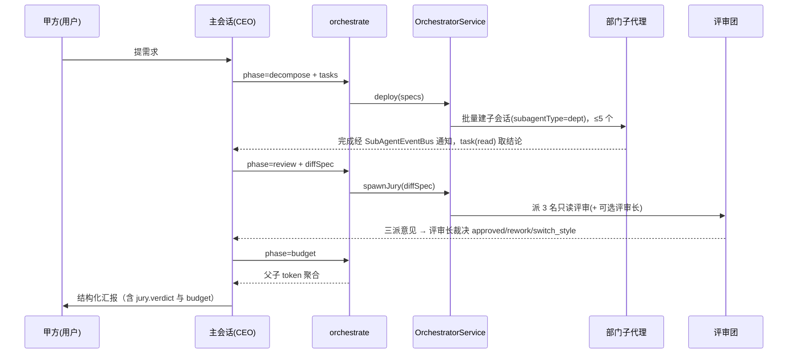

# God Mode 编排（甲方-乙方协作）

GOD 权限模式下的多代理协作范式：主会话升级为「CEO / 总汇报员」，把执行与评审交给派发出的子代理，自己只做拆解、派发、吸收结论、裁决与向用户（甲方）汇报。

## 什么是 God Mode？

用户（甲方）提出需求，AI 主会话（乙方 CEO）不再亲自下场改代码，而是经 `orchestrate` 工具把工作拆给「部门」子代理并行执行，再组一个只读「评审团」对产出辩论裁决，最终由 CEO 汇总向甲方汇报。治理（权限审批、模式切换）由 CEO 代为决策，授权语义等同 AUTO / TARGET（免逐步弹窗），唯一保留的拦截是灾难性删除命令。

**关键特征**:
- 仅 `AgentMode.GOD` 可用：`orchestrate` 在非 GOD 模式调用直接报 `NOT_GOD_MODE`
- 主会话当 CEO，不下场干活；子代理之间不直连，完成经 `SubAgentEventBus` 单向通知父会话，CEO 用 `task(action="read")` 拉结论
- 一批最多派发 `MAX_BATCH_DEPARTMENTS = 5` 个部门（对齐 `SubAgentEventBus.MAX_RUNNING = 5`）
- 双执行风格：`exec-conservative`（最小改动、遵循现有风格）与 `exec-modern`（革新实现、最佳实践）
- 评审团三派只读评审（tough / pragmatic / optimist），可选追加评审长 `forehead` 出结构化裁决
- 预算可查：`orchestrate(phase="budget")` 聚合父 + 全部子会话的 token

## 代码位置

| 方面 | 位置 |
|------|------|
| 模式定义 | `feature/agent/domain/model/ChatSession.kt`（`AgentMode.GOD`） |
| 编排工具 | `feature/agent/domain/tool/orchestration/OrchestrateTool.kt`（`orchestrate`） |
| 编排域服务 | `feature/agent/domain/orchestration/OrchestratorService.kt`（@Singleton） |
| 派发实现 | `OrchestratorService.deploy` / `spawnJury`（经 `SessionUseCase.newSubSessionEntity`，`subagentType = "dept"`） |
| 权限放行 | `feature/agent/domain/permission/ToolPermissionPolicyEngine.kt`（GOD 与 AUTO / TARGET 同分支） |
| 模式切换 | `feature/agent/domain/tool/mode/SwitchModeTool.kt`（GOD 可经 switchMode 申请，ASK 授权） |
| 内置角色定义 | `app/src/main/assets/agents/`（6 个 God Mode 专属 .md） |
| 提示词 | `app/src/main/assets/prompts/83-god-mode.md`、`60-tools-and-paths.md` |
| 测试 | `OrchestratorServiceTest.kt`、`tool/orchestration/OrchestrateTest.kt` |

## orchestrate 的四个 phase

| phase | 必填参数 | 行为 |
|-------|---------|------|
| `decompose`（默认） | `tasks`（数组，每项 `{name, agent?, model?, reasoningEffort?, prompt}`） | 批量派发部门子代理；解析后为空报 `MISSING_TASKS`；超 5 个截断并回报错误 |
| `review` | `diffSpec` | 派 3 名只读评审（严苛 / 务实 / 建设）；`foreman=true` 追加评审长出裁决；diffSpec 空白报 `MISSING_DIFF` |
| `status` | — | 列子会话及其 RUNNING / COMPLETED 状态 |
| `budget` | — | 聚合父子 token：totalInput / totalOutput / totalTokens / subCount / running / depts[] |

错误码：`NOT_GOD_MODE`（非 GOD 模式）、`INVALID_PHASE`（未知 phase）、`MISSING_TASKS`、`MISSING_DIFF`、兜底 `ORCHESTRATE_ERROR`。`status` / `budget` 两个只读 phase 不触发授权弹窗。

## 内置角色（assets/agents/）

| 文件 | 角色 | 工具集 |
|------|------|--------|
| `exec-conservative.md` | 保守执行部门：最小改动、遵循现有风格 | readFile / list / search / writeFile / editFile / sendFile |
| `exec-modern.md` | 现代执行部门：革新实现、最佳实践 | 同上 |
| `review-tough.md` | 评审·严苛派：找必炸 Bug、硬约束违规 | readFile / list / search（只读） |
| `review-pragmatic.md` | 评审·务实派：可维护性、测试、性价比 | 同上（只读） |
| `review-optimist.md` | 评审·建设派：亮点 + 风险 + 跟进 | 同上（只读） |
| `forehead.md` | 评审长：汇总三派意见给结构化裁决（approved / rework / switch_style） | 同上（只读） |

## 编排流程

## 不变量

1. **GOD 门控**：`orchestrate` 只对主会话（无 agentDefinition 绑定的根会话）注入可见，且执行时 `context.mode != GOD` 即 `NOT_GOD_MODE`
2. **单向通信**：子代理之间不直连，结论一律经 `SubAgentEventBus` 回父会话
3. **并发上限**：一批最多 5 个部门，且受 `SubAgentEventBus.isFull` 约束；部门子代理不能再嵌套调用 `task`
4. **授权语义**：GOD 复用 AUTO / TARGET 的免弹窗放行，但 `checkCatastrophicRm` 命中仍 DENY

## 关系

| 关联概念 | 关系 | 描述 |
|---------|------|------|
| [Agent 权限模式](./Agent权限模式.md) | 依赖 | GOD 是五档权限模式之一，放行语义同 AUTO / TARGET |
| [子代理](./子代理.md) | 复用 | 部门与评审团都是子代理会话（`parentId` 挂主会话，`subagentType = "dept"`） |
| [检查点](./检查点.md) | 兜底 | 部门子代理的文件改动仍走检查点快照，可回滚 |
