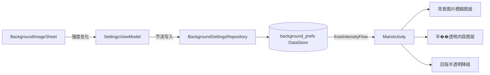
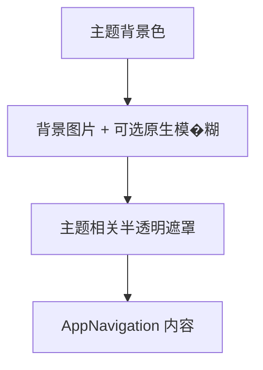

# 磨砂玻璃背景技术设计

## 1. 描述

本设计扩展现有全局自定义背景能力，为背景图片增加可调模糊，并让主要内容区域呈现半透明磨砂材质。设置继续由 `BackgroundSettingsRepository` 统一存储，界面状态由 `SettingsViewModel` 暴露，全局效果由 `MainActivity` 根 Compose 图层消费。

设计采用渐进增强策略：支持原�生模糊时启用实时效果，不支持时仅使用半透明遮罩，不引入软件位图模糊及额外图片缓存。

## 2. 设计决策

### 2.1 使用现有 DataStore

磨砂强度与背景路径、透明度属于同一功能域，继续存入 `background_prefs`，避免增加新的存储结构或数据库迁移。

### 2.2 使用单一归一化强度

持久化值采用 `0f..1f`。设置界面显示为 `0..100%`，渲染层将归一化值映射为模糊半径和内容面板透明度。该方式避免把设备相关 dp 值写入持久化数据。

### 2.3 渐进增强

支持 Compose 原生模糊时，在背景图片图层应用模糊修饰符。旧版或不支持环境不执行模糊，仅调整前景表面透明度，避免昂贵的软件位图处理。

### 2.4 最小化内容面板改造

第一阶段在应用根内容图层统一提供磨砂材质参数，不逐个重写所有 Card、导航栏和功能页面。若现有页面使用完全不透明背景导致效��果不可见，实施阶段仅调整主要根容器和公共表面组件，避免无关 UI 改造。

## 3. 架构



## 4. 组件与接口

### 4.1 BackgroundSettingsRepository

文件：`app/src/main/java/com/aicode/feature/settings/data/repository/BackgroundSettingsRepository.kt`

新增职责：

- 定义磨砂强度 DataStore key。
- 提供默认值、最小值和最大值。
- 暴露 `frostIntensityFlow: Flow<Float>`。
- 提供 `setFrostIntensity(intensity: Float)`，写入前限制到合法范围�。
- 提供 UI 百分比与归一化值的映射函数。

建议数据约束：

```text
持久化范围: 0.0 .. 1.0
默认值: 0.5
背景模糊半径: 0.dp .. 24.dp
```

最终半径可在实现时根据 Compose 和项目最低 SDK 的实际支持能力微调，但不得改变持久化语义。

### 4.2 SettingsViewModel

文件：`app/src/main/java/com/aicode/feature/settings/presentation/SettingsViewModel.kt`

新增职责：

- 收集 `frostIntensityFlow` 并暴露��只读状态。
- 提供 `setFrostIntensity`。
- 复用背景透明度设置的节流模式，避免滑块拖动时产生过量 DataStore 写入。

### 4.3 BackgroundImageSheet

文件：`app/src/main/java/com/aicode/feature/settings/presentation/component/BackgroundImageSheet.kt`

新增参数：

```kotlin
frostIntensity: Float
onFrostIntensityChange: (Float) -> Unit
```

交互设计：

- 在透明度滑块下方增加磨砂强度标题、百分比和滑块。
- 弹窗打开时使用持久化状态初始化本地滑块值。
- 拖动时更新本地值并调用回调，实现实时预览。
- 未选择背景图片时可以保留滑块设置，但视觉效果不启用。

### 4.4 SettingsScreen

文件：`app/src/main/java/com/aicode/feature/settings/presentation/component/SettingsScreen.kt`

负责向 `BackgroundImageSheet` 传入强度状态与事件，并在背景设置摘要中继续优先展示现有背景状态，不扩大列表项信息密度��。

### 4.5 MainActivity 根渲染层

文件：`app/src/main/java/com/aicode/MainActivity.kt`

根图层调整为以下顺序：

1. 主题背景色。
2. 自定义背景图片及原生模糊。
3. 半透明材质遮罩或主要内容表面。
4. 应用导航和页面内容。

背景图片仍只解码一次，模糊强度变化不得作为 `produceState` 的图片解码 key。



## 5. 数据模型

DataStore 新增一项：

```text
key: frost_intensity
type: Float
range: 0.0 .. 1.0
default: 0.5
```

读取和写入均执行 `coerceIn(0f, 1f)`。现有用户没有该 key 时自动使用默认值，不需要显式迁移。

## 6. 平台兼容策略

- 使用编译期可用且能在项目最低 SDK 安全运行的 Compose API。
- 原生模糊能力只在受支持的平台启用。
- 不支持时不创建软件模糊位图，也不增加 RenderScript 依赖。
- 降级路径仍使用主题相关的半透明表面色，以保证前景文本对比度。
- Dialog 属于独立窗口，不承诺继承 Activity 根图层的模糊效果。

## 7. 正确性属性

### CP-1 范围闭包

对任意输入强度，存储值和渲染值始终位于 `0f..1f`。

### CP-2 零强度恒等性

当强度为�零时，背景图片不应用模糊，且不得因效果管线改变图片尺寸或裁剪方式。

### CP-3 状态恢复

写入任意合法强度后重新创建 Activity，收集到的强度必须与写入值一致。

### CP-4 无背景隔离

当背景路径为空时，磨砂设置不得创建图片解码任务或覆盖正常主题背景。

### CP-5 降级安全

在不支持原生模糊的环境中，任意合法强度不得触发崩溃，页面交互保持可用。

### CP-6 解码稳定

仅改变磨砂强度时，背景图片不得重复解码。

## 8. 错误处理

- DataStore 值非法：限制到合法范围并继续渲染。
- 图片文件不存在或解码失败：保持现有空图片行为，不启用背景效果。
- 原生模糊不可用：自动使用半透明降级效果。
- 快速拖动滑块：界面状态实时变化，持久化写入通过节流合并。
- 应用切换主题：半透明遮罩颜色跟随当前 Material 主题重新计算。

## 9. 测试策略

### 9.1 单元测试

- 百分比与归一化强度双向映射。
- 小于最小值和大于最大值时的范围限制。
- 默认值读取。
- `setFrostIntensity` 的持久化结果。

### 9.2 Compose/UI 测试

- 背景设置弹窗显示磨砂强度标签、百分比和滑块。
- 拖动滑块触发正确的归一化回调值。
- 外部状态变化后滑块显示同步更新。
- 无背景时移除按钮行为保持不变。

### 9.3 构建与人工验证

- 运行 `./gradlew :app:testUniversalDebugUnitTest`。
- 运行 `./gradlew :app:assembleUniversalDebug`。
- 在支持原生模糊的设备上验证 0%、中间值和 100%。
- 在不支持原生模糊的设备或模拟器上验证半透明降级和交互稳定性。
- 验证重启恢复、主题切换、移除并重新选择背景。

## 10. 风险与缓解

### 风险 1：内容页面存在不透明容器

部分页面可能使用完全不透明 Surface，导致�根层背景不可见。实施时先定位主要公共容器，仅调整阻断效果的根级表面，避免逐页面重构。

### 风险 2：模糊对 GPU 性能有影响

限制最大模糊半径，不使用软件位图模糊，且背景保持静态单次解码。

### 风险 3：不同 Android 版本视觉不一致

接受渐进增强差异，以可读性和稳定性优先。旧版明确降级为半透明效果，不承诺等效模糊。

## 11. 实施边界

本设计阶段仅创��建规格文档，不修改应用代码。后续应使用实施计划将工作拆分为存储层、状态层、设置 UI、根渲染层、资源和测试任务。
