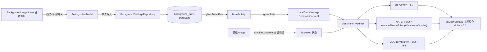

# 玻璃材质系统技术设计

Feature Name: liquid-glass-materials
Updated: 2026-09-16

## 1. 描述

基于 Kyant0/AndroidLiquidGlass（backdrop）库建立三档玻璃材质系统。壁纸层标记为 backdrop 源（静态、录制一次、零逐帧开销），玻璃面板通过 `glassPanel` Modifier 消费效果链：磨砂 = `blur`；水玻璃 = `blur` + 自定义 AGSL 水波折射；液体玻璃 = `vibrancy` + `blur` + `lens`（透镜折射 + 色散）。染色表面由 `onDrawSurface` 承担，完全替代半透明背景。

## 2. 设计决策

### 2.1 复用 backdrop 库（`io.github.kyant0:backdrop:1.0.6`）

选型结论（调研于 2026-09-16）：

| 候选 | 结论 |
| --- | --- |
| Kyant0/AndroidLiquidGlass | 采纳：3.8k stars、持续发版、Compose 原生、minSdk 21、内置 blur/lens/vibrancy |
| QmDeve/AndroidLiquidGlassView | 排除：View 体系，与 Compose 架构不匹配 |
| Haze | 排除：仅模糊，折射/透镜需自研补齐 |
| neilyich/glassmorphism-compose | 排除：功能弱 |

**版本锁定 1.0.6**：2.0+ 编译于 compileSdk 37，与项目 AGP 8.9.3（最高支持 SDK 36）冲突；1.0.6 编译于 compileSdk 36、jvmToolchain 21，与项目完全兼容。API 表面（drawBackdrop / effects DSL / blur / lens / vibrancy / rememberLayerBackdrop / layerBackdrop）与 2.0 一致。

**1.0.6 与 2.0 API 差异**：1.0.6 的 effects 无 `runtimeShaderEffect`（2.0 新增）。水玻璃档改用平台 API `android.graphics.RenderEffect.createRuntimeShaderEffect(RuntimeShader, uniformShaderName)` 构造后经库的 `effect(RenderEffect)` 链入效果链——`createChainEffect` 顺序保证 RuntimeShader 采样到上游 blur 输出，与 2.0 语义等价。

库的效果链约束：`color filter ⇒ blur ⇒ lens` 顺序生效；`lens` 需要 `CornerBasedShape`；效果仅 Android 12+，`RuntimeShader` 类效果需 Android 13+。

### 2.2 平台门槛 API 33，不做降级

AGSL 是 Android 13 平台能力。`glassPanel` Modifier 内部 `Build.VERSION.SDK_INT < 33` 时直接透传原 Modifier，三档效果只考虑 API 33+ 一种路径，实现最简。`targetSdk 28` 锁定不受影响（平台 API 按运行时版本判断，与 targetSdk 无关；项目 `compileSdk` 已满足）。

### 2.3 仅壁纸层作为 backdrop 源

壁纸是静态内容，backdrop 源录制一次即可，玻璃面板折射零逐帧重录制开销。v1 明确不采样应用内容层（逐帧重录制 + 自反馈伪影风险）。

### 2.4 复用 `frost_intensity` 键，DataStore 新增 5 键

统一模糊半径直接复用现有键（0..1 归一化，渲染时 × 32dp），三档共用，旧设置无感迁移，零 Room 迁移。染色自动跟随 `colorScheme.surface`，不单独存键。

`background_prefs` 新增键：

| 键 | 类型 | 默认 | 含义 |
| --- | --- | --- | --- |
| `glass_enabled` | Boolean | false | 玻璃总开关 |
| `glass_mode` | String | "frosted" | 档位：frosted / water / liquid |
| `glass_sidebar_enabled` | Boolean | true | 侧边栏区域开关 |
| `glass_input_enabled` | Boolean | true | 输入框区域开关 |
| `glass_content_enabled` | Boolean | true | 内容面板区域开关 |
| `water_wave_animated` | Boolean | false | 水波流动动画开关 |

### 2.5 不做崩溃自愈

用户决策：不加 RenderThread SIGSEGV 崩溃标记与启动回退机制。AGSL shader 在编译期通过 `RuntimeShader` 构造校验 + 真机验证覆盖风险。

### 2.6 v1 不迁移既有伪玻璃组件

`FloatingTabBar` 等渐变模拟玻璃的组件保持不动，新系统仅覆盖壁纸 backdrop + 三区域玻璃面板，后续版本再迁移。

## 3. 架构



## 4. 组件与接口

### 4.1 `core/ui/glass/GlassMode.kt`

```kotlin
enum class GlassMode { FROSTED, WATER, LIQUID }

data class GlassSettings(
    val enabled: Boolean,
    val mode: GlassMode,
    val sidebarEnabled: Boolean,
    val inputEnabled: Boolean,
    val contentEnabled: Boolean,
    val radiusDp: Float,        // frost_intensity * 32f
    val waterWaveAnimated: Boolean,
)

val LocalGlassSettings = staticCompositionLocalOf { GlassSettings.DISABLED }
```

### 4.2 `core/ui/glass/GlassPanel.kt` — glassPanel Modifier

项目侧封装（与库自带 `Modifier.glassPanel` 命名衔接）：

```kotlin
fun Modifier.glassPanel(
    backdrop: Backdrop,
    shape: CornerBasedShape,
    settings: GlassSettings = LocalGlassSettings.current,
): Modifier
```

职责：

1. `settings.enabled == false || SDK < 33` → 返回原 Modifier（R4）
2. 按档位组装效果链（顺序遵循 color filter ⇒ blur ⇒ lens）：
   - FROSTED：`blur(radiusPx)`
   - WATER：`blur(radiusPx)` + `runtimeShaderEffect(WaterWaveShader)`
   - LIQUID：`vibrancy()` + `blur(radiusPx)` + `lens(refractionHeight = min(radiusPx / 2, shape.minCornerRadius), chromaticAberration = true)`
3. `onDrawSurface` 绘制 `colorScheme.surface.copy(alpha = max(0.3f, tintAlpha))`；LIQUID 档额外绘制边缘高光描边
4. 区域开关判断由调用方接线处完成（Modifier 保持无状态）

### 4.3 `core/ui/glass/WaterWaveShader.kt` — 水波 AGSL

- AGSL 源码字符串：正弦叠加波浪对上游 shader 采样坐标做 UV 偏移（折射）
- 1.0.6 无 `runtimeShaderEffect`，水玻璃档在 `GlassPanel` 内 `remember` 一个 `android.graphics.RuntimeShader`，effects block 中 `setFloatUniform` 后用 `RenderEffect.createRuntimeShaderEffect(shader, "uContent")` + 库 `effect()` 链入；`uniformShaderName = uContent` 链式采样上游 blur 输出
- 静态模式 `uTime` 固定值（[WATER_WAVE_STATIC_TIME]），动画模式 `withFrameNanos` 时间驱动相位

### 4.4 `BackgroundSettingsRepository` 扩展

- 新增 6 个键的 Flow 与 setter（`setGlassEnabled` / `setGlassMode` / `setGlassPanelAreaEnabled` / `setWaterWaveAnimated`）
- `glassStateFlow: Flow<GlassSettings>` 聚合流：`combine` 各键 + `frostIntensityFlow` 换算 `radiusDp`
- `glass_mode` 反序列化容错：未知值回退 `FROSTED`（R5.4）

### 4.5 `SettingsViewModel` 扩展

- `glassState: StateFlow<GlassSettings>`（聚合自 repository）
- 写入方法节流模式对齐现有 `frostIntensityWriteJob` 写法

### 4.6 MainActivity 接线

- 壁纸 `Image` 加 `Modifier.backdrop()`（源标记）
- 根容器包 `Backdrop(backdropState)` scope，`CompositionLocalProvider(LocalGlassSettings provides glassState)` 包裹内容
- 侧边栏 / 输入框 / 内容面板容器分别接 `Modifier.glassPanel(...)`，区域开关在接线处短路

### 4.7 设置 UI（BackgroundImageSheet 扩展）

- 总开关 `AppSwitch`（关闭时隐藏子项）
- 材质档位：`SegmentedTabs`（磨砂 / 水玻璃 / 液体玻璃）
- 半径滑条：现有磨砂强度滑条原地升级，文案改"玻璃模糊半径"，0..100% ↔ 0..32dp
- 三区域开关：3 个 `AppSwitch` 行
- 水波动画开关：仅 water 档显示
- API < 33：显示"玻璃材质需要 Android 13+"提示行，全部设置项禁用

## 5. 数据模型

见 2.4 键表。`GlassSettings` 为不可变 data class，`DISABLED` 静态实例作为 CompositionLocal 默认值（enabled=false）。

## 6. 正确性属性

1. `radiusDp = frostIntensity * 32f`，全链路唯一换算点在 repository 聚合流
2. 效果链顺序恒为 color filter ⇒ blur ⇒ lens / runtimeShader
3. API < 33 时 `glassPanel` 输出与输入 Modifier 恒等
4. 染色 alpha 恒 >= 0.3
5. `glass_mode` 解析结果恒 ∈ {FROSTED, WATER, LIQUID}
6. 区域开关为 false 时该区域无任何 backdrop 消费节点

## 7. 错误处理

| 场景 | 处理 |
| --- | --- |
| API < 33 | Modifier 透传，设置项禁用并提示系统版本要求 |
| `glass_mode` 未知值 | 回退 FROSTED |
| AGSL 构造异常 | WaterWaveShader 回退纯 blur（try-catch 一次性校验） |
| DataStore 读失败 | Flow 抛错由 `catch` 算子回退默认值（沿用仓库既有模式） |

## 8. 测试策略

- 单元测试（JVM）：Repository 键读写与默认值、`glass_mode` 容错解析、`radiusDp` 换算、`GlassSettings` 聚合
- 编译验证：每里程碑冒烟编译 `./gradlew :app:assembleUniversalDebug`
- 真机验证（API 33+）：三档切换视觉、三区域开关、水波动画启停、半径滑杆实时性、深浅主题可读性、重启配置保留
- 真机验证（API 26-30）：确认行为与现状一致（无玻璃、壁纸模糊照旧）

## 9. 参考

[^1]: (Website) - [Kyant0/AndroidLiquidGlass GitHub](https://github.com/Kyant0/AndroidLiquidGlass)
[^2]: (Website) - [Backdrop 文档：Backdrop effects](https://kyant.gitbook.io/backdrop/api/backdrop-effects)
[^3]: (Filename#L37) - `app/src/main/java/com/aicode/feature/settings/data/repository/BackgroundSettingsRepository.kt`
[^4]: (Filename#L256) - `app/src/main/java/com/aicode/MainActivity.kt`
[^5]: (Filename#L106) - `app/src/main/java/com/aicode/core/ui/FloatingTabBar.kt`
