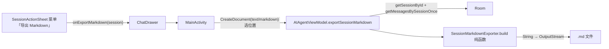

# 单会话导出 Markdown — 技术设计

Feature Name: export-session-markdown
Updated: 2026-09-17

## Description

在现有「导出会话」（tar.gz 备份）旁并列增加 Markdown 可读格式导出。生成器为纯函数放 `feature/backup/domain/`，ViewModel 负责取数（sessionUseCase.getSessionById + agentMessageDao.getMessagesBySessionOnce）与写流，入口复用会话长按菜单（SessionActionSheet 加一项），保存走 SAF CreateDocument（text/markdown）。

## Architecture



## Components and Interfaces

### 1. SessionMarkdownExporter（feature/backup/domain/SessionMarkdownExporter.kt）

```kotlin
object SessionMarkdownExporter {
    fun build(
        title: String,
        messages: List<AgentMessageEntity>,
        exportedAt: Long = System.currentTimeMillis(),
    ): String
}
```

- 过滤：`isCompacted || isContextSummary || isCompactionMarker` 及 USER 且 content 以 `BACKGROUND_NOTIFICATION_PREFIX` 开头的行。
- 渲染顺序保持 DAO 返回序（timestamp 升序）。
- 工具行：`> 工具 \`toolName\`` +（isError 时）`· 失败` + 参数单行化截断 300 字符。
- 附件：USER 消息后逐行 `[附件: fileName]`。
- 时间格式 `yyyy-MM-dd HH:mm`（java.time，minSdk 26 可用）。
- 头部 token 合计取消息行 inputTokens/outputTokens 求和。

### 2. AIAgentViewModel.exportSessionMarkdown

与 `exportSession`（AIAgentViewModel.kt:2271）同构：

```kotlin
fun exportSessionMarkdown(sessionId: String, output: OutputStream, onResult: (Boolean) -> Unit)
```

取数 → build → `output.write(text.toByteArray())`（IO dispatcher）→ finally 关流。

### 3. MainActivity launcher

`markdownExportLauncher = CreateDocument("text/markdown")`，同款 pendingExportMarkdownSessionId + openOutputStream + Toast 模式（对照 sessionExportLauncher，MainActivity.kt:445-471）。ChatDrawer 新参 `onExportMarkdown: (ChatSession) -> Unit`，文件名 `aicode-session-<safeTitle>-<ts>.md`。

### 4. SessionActionSheet 菜单项

在「导出」（tar.gz）后插入 `SheetActionRow(icon = FeatherIcons.FileText, label = chat_export_session_markdown)`，回调 `onExportMarkdown()`。

## Correctness Properties

- 纯函数无副作用：相同输入（消息列表 + 时间）产出相同 Markdown。
- 消息顺序与 DAO 返回一致（timestamp 升序），对话可读。
- 过滤规则保证内部消息（压缩/摘要/锚点/后台通知）零泄漏。
- tar.gz 备份导出路径完全不动，向后兼容。

## Error Handling

| 场景 | 处理 |
|------|------|
| 会话无消息 | 仍产出头部（0 条消息），不报错 |
| openOutputStream 失败 | Toast chat_export_session_failed（现有文案） |
| 写流异常 | runCatching 捕获记 FileLogger，回调 false，finally 关流 |

## Test Strategy

`SessionMarkdownExporterTest`（纯 JVM，AgentMessageEntity 为纯数据类）：
- 头部含标题/导出时间/消息数/token 合计
- USER 附件标注
- TOOL 记录含工具名、失败标记、参数单行截断
- 过滤 isCompacted / isContextSummary / isCompactionMarker / 后台通知
- 空 content 的 ASSISTANT 跳过

## References

- `app/src/main/java/com/aicode/feature/backup/data/BackupManagerImpl.kt:123` — 现有 tar.gz 导出
- `app/src/main/java/com/aicode/feature/agent/presentation/AIAgentViewModel.kt:2271` — exportSession 模式
- `app/src/main/java/com/aicode/MainActivity.kt:445` — sessionExportLauncher 模式
- `app/src/main/java/com/aicode/feature/agent/presentation/component/ChatDrawer.kt:962` — SessionActionSheet
- `app/src/main/java/com/aicode/feature/agent/data/local/entity/AgentMessageEntity.kt:18` — 消息字段
