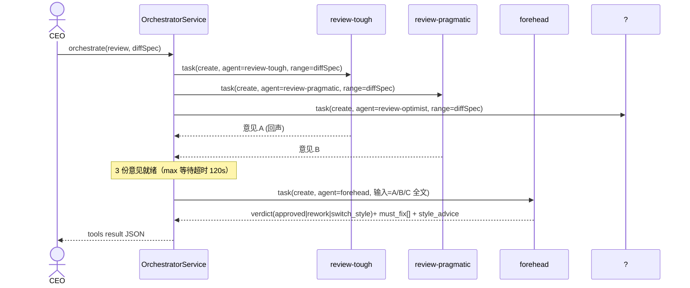

# God Mode（甲方-乙方协作模式）

Feature Name: god-mode
Updated: 2026-09-18

## Description

God Mode 把会话角色重构成「甲方/乙方」协作：用户作为投资者只提需求与目标，AI（主会话）充当
**CEO/总汇报员**，通过新的 `orchestrate` 工具把需求分解为子任务派发给**AI 部门**（可指定不同
模型与双执行风格），关键产出经**评审团**（多立场子代理辩论）与**评审长**裁决，最终向甲方汇报。
治理层（权限审批 / 模式切换）由 CEO 代为决策，用户不再逐项弹窗。

本特性最大化复用现有子代理体系（AgentDefinition 定义、`task` 派发、AUTO/TARGET 预授权、
完成通知回传、`sideLlmCall` 旁路调用、`review.md` 评审基座），新增一个 `orchestrate` 工具与一组
角色资产撬动「分解 → 派发 → 评审 → 裁决 → 汇报」闭环。

## Architecture

```mermaid
graph TD
    A["甲方用户"] -->|需求/目标/预算| C["CEO(主会话, GOD 模式)"]
    C -->|orchestrate(decompose) 拆解| S["orchestrate 工具 / OrchestratorService"]
    S -->|创建子会话| D1["部门 exec-conservative"]
    S -->|创建子会话| D2["部门 exec-modern"]
    S -->|等待完成通知| E["SubAgentEventBus"]
    E -.COMPLETED.-> C
    C -->|orchestrate(review) 成立| J1["评 trou 严苛"]
    C -->|orchestrate(review) 成立| J2["评 examplar 务实"]
    C -->|orchestrate(review) 成立| J3["评 optimist 建设"]
    J1 & J2 & J3 -->|三份意见| F["评审长 forehead"]
    F -->|裁决 approved/rework/switch_style| C
    C -->|approved 汇报 / 返工再派| A
    S -->|预算聚合| G["BudgetLedger(汇总子部门 cost)"]
```

`orchestrate` 是唯一新增工具；部门、评审员、评审长均为现有 AgentDefinition 资产（`assets/agents/*.md`），
由 `SystemPromptProvider` 按 name 注入与 `TaskTool` 式派发。

## Components and Interfaces

### 1. `AgentMode.GOD` 接入（模式枚举扩展）

- `ChatSession.kt#AgentMode` 增加 `GOD` 值；不改变 `BUILD/PLAN/AUTO/TARGET` 已有语义。
- 进入路径：会话头超小菜单「切换到 God Mode」（复用现有 mode 切换 UI 位，`ChatInputBar.kt:340-380`）；
  切换前用 `askUserQuestion` 确认治理策略（见 R1-A验2）。
- 退出：复用 `switchMode` 工具回 BUILD；退出时清理编排状态与预算 ledger 临时态。

**边界**：GOD 不改变 `TARGET` 终止机制（goalStepCount/failCount 仍只对 TARGET 生效）。
GOD 下 `orchestrate` 需要在 workflow 内可见并注入 sessionId（经 AgentContext，现有 `context.sessionId`）。

### 2. `OrchestratorService`（域层编排器，新）

```kotlin
interface OrchestratorService {
    /** 分解：按 spec 一次创建多个部门子会话 */
    suspend fun decompose(spec: DecomposeSpec): List<DeptHandle>
    /** 评审：成立评审团，等 3 份意见后成立评审长裁决 */
    suspend fun runJury(context: JuryContext): JuryVerdict
    /** 汇总预算（父 + 子 cost） */
    suspend fun budget(): BudgetSnapshot
}
```

- 监听 `SubAgentEventBus`：SPAWNED → 子会话 workflow 启动（ViewModel 现有 `spawnSubAgentWorkflow` 路径）；
  COMPLETED/FAILED → `notifyParentSubAgentFinished` 已现成，CEO 经 `task(read)` 拉结论。
- `runJury` 用「父代理串行派发只读子代理」的现有能力：3 名评审员各自 `task(create, agent=review-tough/...)`
  高优先，等三道通知全部回落后以评审长 `forehead` 汇总。实现行进一版不做子代理间直连，只经 CEO 中转
  （对齐现有「只能读最后一条回复」约束）。

### 3. `orchestrate` 工具（AgentTool，新）

| 参数 | 类型 | 必填 | 说明 |
| --- | --- | --- | --- |
| `phase` | STRING | 否 | `decompose`（默认）/ `review` / `status` / `budget`。`phase=decompose` 派部门，`review` 组评审团，`status`/`budget` 只读查。 |
| `goal` | STRING | 否 | decompose 时的一段需求 / 任务描述（喂给部门的完整目标）。 |
| `tasks` | ARRAY<OBJECT> | 否 | decompose 拆出的子任务：`{name, agent, model?, reasoningEffort?, style?}` |
| `diffSpec` | STRING | 否 | review 时的改动范围（文件清单 / PR diff / 未提交改动）。 |
| `budget` | INTEGER | 否 | 一次设置本场协作预算（tokens 或条数），覆盖会话默认。 |

- `permissionPolicy`：`ASK`（编排创建子会话属高影响），但 God 治理策略为「甲方全交」时被策略引擎放行。
- capability：`EXTERNAL_TOOL` / `WRITE_WORKSPACE`（decompose 派发不直接写工作区，重新审视列入
  `EXTERNAL_TOOL` 即可，避免误触发 PLAN 拦截）。
- 复用 `TaskTool` 解析 `agent=` provider/model/effort 的现成函数（`TaskTool.kt:161-171`），做成 `AgentParamsResolver` 共享。

### 4. 部门与评审角色资产（`assets/agents/*.md`，新 5 个）

| 文件名 | name | 风格/定位 | 工具白名单 | 模型策略 |
| --- | --- | --- | --- | --- |
| `exec-conservative.md` | exec-conservative | 遵循现有代码风格、最小 diff、保项目惯例 | 与普通执行 agent 一致（含 writeFile/editFile） | 继承父会话 |
| `exec-modern.md` | exec-modern | 革新/现代化格式与最佳实践 | 同上 | 继承父会话 |
| `review-tough.md` | review-tough | 严苛挑刺：只找必挂 bug 与硬约束 | `[readFile, list, search]` | 继承 |
| `review-pragmatic.md` | review-pragmatic | 务实：关注可维护性、测试、性价比 | `[readFile, list, search]` | 继承 |
| `review-optimist.md` | review-optimist | 建设：找亮点与可长线方案，平衡风险 | `[readFile, list, search]` | 继承 |
| `forehead.md` | forehead | 评审长：读三份意见裁决 | `[readFile, list, search]` | 继承 |

- 内部复用现成 `review.md` 的「怎么审」六维框架（`app/src/main/assets/agents/review.md`），每个角色在同
  框架上叠加性格倾向一段。
- 新版本第 1 步先各需内容由 `DEFAULT_INJECT`（base+skills+memory+projectRules）组装，并显式
  `disallowedTools` 禁掉 `writeFile`/`editFile`/`Bash`（评审只读）。评审角色 prompt 声明
  「只能被 CEO 读到最后一条回复」，沿用 `90-subagent-base.md` 约束。

### 5. 预算账本 `BudgetLedger`（域层，轻量）

- 复用会话 token 累积字段（`ChatSession.totalInputTokens/totalOutputTokens`）与 DB DAO，
  在 `orchestrate(status/budget)` 时聚合父+子会话数值。
- 不新增表：会话已持久化 cost；GOD 子部门即是子会话，天然携带自身 cost。
- 预算上限存 `ChatSession` 新增字段 `godBudgetTokens: Int? = null`（null=不限额）；
  `executeEvents` 主循环在每次 `LlmResponse` 入账后检查，超限则把 `BudgetExhausted` 通知搭到下一次
  工具结果顶层 `notifications`，CEO 据此 `switchMode(BUILD)` 并向用户汇报。

### 6. War Room UI（战区视图，新）

- 新增 `GodWarRoomOverlay` / `GodDashboardCard`（Compose）挂在 `AIChatPanel` 顶部，仅 `GOD` 模式显示：
  - 子会话卡片列表（`subSessionsByParent`，现成：`AIAgentViewModel.kt:390`）：状态芯片、
    所属模型、产出摘要（取子会话最后一条非空助手回复）、裁决结果 badge。
  - 预算条：聚合 cost / `godBudgetTokens`（R7）。
- 新增 `AgentUIMessage.sender: String?`（默认 null，普通会话不变）；GOD 下子会话卡片作为可展开行
  渲染在 CEO 消息流之间，气泡左侧加来自 agent 名微标签（多语言进入 strings.xml）。

### 7. 评审团辩论协议（多立场采集 → 裁决，新）

为避免「三份意见各说各话、无人收口」，Jury 采用 **两段式**：



- `runJury` 实现为「等 3 名评审的 COMPLETED 通知全部落地后，一次性以 `sideLlmCall` 或 `task(forehead)` 汇总」；
  采用 `task` 派发 forehead 以复用子会话隔离与权限裁剪，避免主会话上下文被三份长意见撑爆。
- 评审员 prompt 由角色文件给出性格倾向（见 §4）并复用 `review.md` 六维框架；`diffSpec` 用绝对文件范围
  传给两轮子会话，避免 `diff` 全量过大。

### 8. 汇报协议（CEO → 甲方，新序列化）

- 每次上帝会话的「里程碑」由 CEO 生成结构化汇报，`orchestrate(phase=report)` 返回 JSON：
  ```json
  { "milestone": "M1", "summary": "…", "changes": ["app/…"], "depts": [{"name","model","status","output"}],
    "jury":{"verdict":"approved","reviewers":["tough","pragmatic","optimist"],"must_fix":[]},
    "budget":{"spent":1234,"limit":10000} }
  ```
- UI 在 War Room 里把 `report` 渲染为「里程碑卡片」（时间线），甲方可逐条追溯决策路径——
  谁写了代码、谁审查、裁决为何、花了多少额度。
- 序列化模型 `GodReport`（纯 data class）供 `AIAgentViewModel` 落库到 `session` 的 `godReports`
  （长度受限 JSON 字段，非新表）。

### 9. 会话编排生命周期与持久化

- `ChatSession` 增字段：`mode`（扩枚举到 `GOD`）、`godBudgetTokens: Int?`、`godStrategy: String?`
  （`full` / `keep`，R1 治理策略）、`godReportsJson: String?`（≤若干条里程碑 JSON）。
- 生命周期：进入 God → `godStrategy` 入库 → CEO 通过 `orchestrate` 派生部门/评审（子会话，沿用黑名单剔除
  `task`）→ 里程碑经 `orchestrate(phase=report)` 写 `godReportsJson` → 退出/超预算 `switchMode(BUILD)`
  清 `godStrategy` 但保留子会话与报告（可读）。
- 不新增 DB 表（全部落在既有 `chat_sessions` 列与消息语义），避免迁移版本冲突。

### 10. 双风格对比产物（P2 增强，作为设计扩展预留）

- 并行「双风格」产物各占一个子会话；评审长裁决 `switch_style` 时 CEO 把对照 diff 以卡片形式贴给甲方，
  不再重跑（详见 append）。

## Data Models

- `ChatSession` 增字段：`godBudgetTokens: Int?`、`godStrategy: String?`、`godReportsJson: String?`（新，非 TARGET）。
- `AgentUIMessage` 增：`sender: String? = null`。
- 复用 `AgentDefinition`（agent 资产模型，无 schema 变更），不新增库表；`god_mode_ledger` 无需建表，
  按需从 `session` 聚合。
- `orchestrate` 工具的入参/出参以 `ToolResult` JSON 承载；子任务描述经 `tasks[].goal` 或 prompt 直传子会话。

## Correctness Properties

1. `GOD` 不外泄执行权限：主会话最小权限（只读 + `orchestrate`），具体写由部门子会话承担。
2. 评审只读不变式：评审团 agent 工具集不含任何写工具（filterToolNames 白名单保证），返回前断言。
3. 编排循环有界：`runJury` 单轮三次意见 + 一次裁决；`rework` 循环计数上限（默认 3）到点停止并汇报。
4. 预算聚合准确：`budget()` = 父会话 + 全部存活子会话 cost；超限同一轮只触发一次通知，不重复轰炸。
5. 模态恢复：退出 GOD 同时还原治理策略缓存、预算上限与编排状态，不残留。
6. 不破坏现有模式路径：GOD 不触碰 TARGET 终止机制、AUTO 手动唯一入口、PLAN 拦截。

## Error Handling

| 场景 | 行为 |
| -- | -- |
| `task.agent` 名无效 | 复用 `AGENT_NOT_FOUND`（含可用名单） |
| 指定 model/provider 不可用 | `orchestrate` 返回明确错误，CEO 改派，节流回 fallback 默认模型 |
| 评审团某评审拉起失败 | 记录跳过，CEOs 以其余评审意见交由评审长裁决，通知中注明缺员 |
| 预算耗尽 | `BudgetExhausted` 通知上抛 → CEO `switchMode(BUILD)` + 汇报，新的子任务不再创建 |
| 子会话 workflow 失败 | COMPLETED/FAILED 通知链已现成；失败细节在 `detail` 提示 CEO 重派或标记返工 |
| 用户中途退出 God | 立即清理，子会话仍保留，用户可手动继续 |

## Test Strategy

- **纯 JVM/无 Android**：
  - `AgentParamsResolverTest`：`agent=` 模型/provider/effort 解析与回退（复用 TaskTool 现成逻辑抽离后单测）。
  - `BudgetLedgerTest`：聚合父+子；超限判定与“一轮只报一次”。
  - `JuryVerdictTest`：三意见 → 裁决映射（approved/rework/switch_style）、跑缺少评审的容错。
  - `toolSchemaTest`：`orchestrate` 的 JSON Schema（= `toJsonSchema()` 复用通道）参数形状声明式断言。
- **Robolectric/androidTest（如环境可用）**：GOD 模式状态机——`LlmResponse` 入账写 budget、超限通知。
- **回归**：现有 `AIAgentViewModelTest`/provider 测试保持绿（不触碰 TARGET/AUTO 路径）。

## References

[^1]: (app/src/main/java/com/aicode/feature/agent/domain/subagent/AgentDefinition.kt#L59) - 角色定义模型（providerId/model/effort/tools 白名单/inject）
[^2]: (app/src/main/java/com/aicode/feature/agent/domain/tool/subagent/TaskTool.kt#L161) - `agent=` 解析现成逻辑，`OrchestratorService` 复用
[^3]: (app/src/main/java/com/aicode/feature/agent/domain/permission/ToolPermissionPolicyEngine.kt#L70) - AUTO/TARGET 预授权语义，God「甲方全交」复用
[^4]: (app/src/main/java/com/aicode/feature/agent/domain/workflow/StatefulAgentWorkflow.kt#L775) - 子代理完成通知链（忙碌搭车 / 空闲注入）
[^5]: (app/src/main/java/com/aicode/feature/agent/domain/workflow/StatefulAgentWorkflow.kt#L1046) - `sideLlmCall` 旁路调用入口（评审长汇总可独立调用）
[^6]: (app/src/main/assets/agents/review.md) - 评审六维框架，供 3 名性格评审员复用
[^7]: (app/src/main/java/com/aicode/feature/agent/domain/model/ChatSession.kt#L6) - AgentMode 枚举扩点
[^8]: (app/src/main/java/com/aicode/feature/agent/domain/model/AgentUiModels.kt#L82) - `AgentUIMessage` 增 `sender`
[^9]: (app/src/main/java/com/aicode/feature/agent/presentation/AIAgentViewModel.kt#L390) - `subSessionsByParent` 现成聚合，War Room 数据源
[^10]: (docs-site/docs/guide/subagent.md) - 子代理用户文档同步点