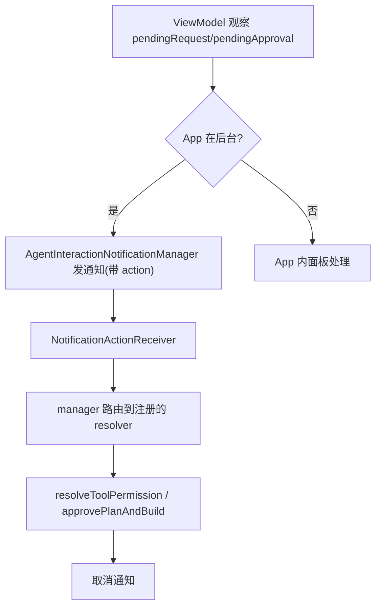

# 通知快捷操作

Feature Name: notification-quick-actions
Updated: 2026-09-13

## Description

App 在后台时，AI 等待工具权限/计划批准会发系统通知并带快捷操作按钮；点击按钮经 BroadcastReceiver 路由回 ViewModel 直接解决请求，通知随之取消。

## Architecture

## Components and Interfaces

### 1. AgentInteractionNotificationManager（单例，新文件）

- 职责：发/取消两类交互通知；持有当前待决请求的 resolver 回调（由 ViewModel 注册）。
- 通知 id：权限 101、计划 102（复用 `agent_complete` 通道，IMPORTANCE_HIGH）。
- 接口：
  - `notifyPermission(request: PendingToolPermission, onChoice: (PermissionChoice) -> Unit)`
  - `notifyPlan(sessionTitle: String, onApprove: () -> Unit)`
  - `cancelPermission() / cancelPlan()`
- 通知 action：`PendingIntent.getBroadcast` → `NotificationActionReceiver`，extras 带 action 类型；权限按钮直接携带选择（APPROVE/DENY）。

### 2. NotificationActionReceiver（Hilt BroadcastReceiver，新文件）

- `@AndroidEntryPoint`，manifest 注册。
- 收到 action → 调用 manager 的路由方法；resolver 回调已失效（App 内已解决/进程重启）时仅取消通知并 FileLogger 记录。
- 权限选择映射：`ACTION_PERMISSION_APPROVE` → PermissionChoice.APPROVE、`ACTION_PERMISSION_DENY` → PermissionChoice.DENY（以既有 PermissionChoice 枚举为准）。

### 3. ViewModel 接线

- collect `toolPermissionManager.pendingRequest` 与 `planApprovalManager.pendingApproval`：
  - 变为非空且 App 在后台（`ProcessLifecycleOwner` 状态判断，复用完成通知的前台判断）→ manager.notifyXxx 并注册 resolver 回调。
  - 变为空 → manager.cancelXxx。
- resolver 回调实现：权限 → `resolveToolPermission(id, choice)`；计划 → `approvePlanAndBuild()`。
- App 内解决入口（`resolveToolPermission`/`approvePlanAndBuild`/`refinePlan`/`stopAgent`）已自然把 pending 置空，collect 分支统一 cancel，无需在每处单独调。

### 4. Manifest

- `NotificationActionReceiver` 注册到 `AndroidManifest.xml`（`exported="false"`）。

## Data Models

- 无新表；extras 传 action 类型字符串，请求 id 由 manager 内存持有（通知与请求同生命周期）。

## Correctness Properties

- 通知操作与 App 内操作走同一解决路径（`resolveToolPermission`/`approvePlanAndBuild`），状态单一事实源。
- resolver 回调失效时 receiver 只取消通知，保证状态一致。
- 权限请求被记忆模式自动放行时 pending 不产生，无需通知。

## Error Handling

- 进程重启后残留通知：App 启动时（AIEditorApp）cancel 两类通知 id，避免僵尸按钮。
- 通知发送失败（渠道不存在等）：runCatching + FileLogger，不影响主流程。

## Test Strategy

- Receiver/manager 路由：单测覆盖 resolver 失效时仅取消通知。
- ViewModel 接线：冒烟编译 + 真机验证（后台等待 → 通知 → 点批准 → 工具继续执行）。

## References

[^1]: `app/src/main/java/com/aicode/feature/agent/presentation/AIAgentViewModel.kt:796` — 既有完成通知模式
[^2]: `app/src/main/java/com/aicode/AIEditorApp.kt:381` — 通知通道创建
[^3]: `app/src/main/java/com/aicode/feature/agent/domain/tool/ToolPermissionManager.kt:23` — pendingRequest 状态
