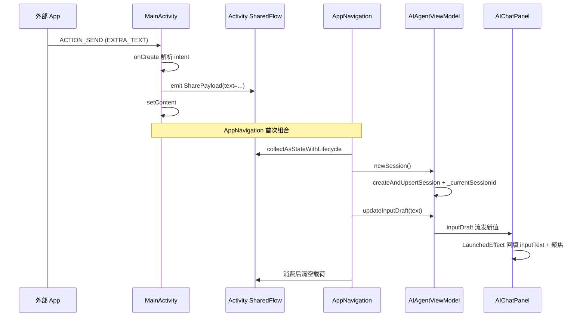

# 接收分享（Receive Share）

Feature Name: receive-share
Updated: 2026-09-17

## Description

为 MainActivity 增加 `ACTION_SEND` 接收能力，让用户从浏览器、代码编辑器、剪贴板工具等外部 App 通过系统分享菜单把选中的文本或图片发给 AiCode。App 冷启动时新建会话并注入内容，热启动时注入当前会话输入框（或无会话时新建）。内容一律填入输入框待用户确认发送，不自动触发，保留用户补充指令的空间。

## Architecture

### 关键约束

`agentViewModel` 在 `AppNavigation` composable 内经 `hiltViewModel()` 创建（`MainActivity.kt:355`），Activity 层无法直接持有或调用。故采用「Activity 级 SharedFlow 桥 + Composable 观察」模式：Activity 解析 Intent 得文本/Uri，写入一个 Activity 持有的 `MutableStateFlow<SharePayload?>`；`AppNavigation` 用 `collectAsStateWithLifecycle` 观察该流，回调里调 `viewModel.updateInputDraft(...)` 注入文本、调 ViewModel 新增的注入入口处理图片，然后清空载荷。

### 数据流

```mermaid
flowchart LR
    Ext["外部 App 分享菜单"] -->|"ACTION_SEND + EXTRA_TEXT/STREAM"| Act["MainActivity"]
    Act -->|"onCreate/onNewIntent"| Parse["parseShareIntent(intent)"]
    Parse -->|"MutableStateFlow SharePayload"| Bridge["Activity 级共享流"]
    Bridge -->|"collectAsStateWithLifecycle 观察"| Nav["AppNavigation composable"]
    Nav -->|"冷启动: newSession() + updateInputDraft"| VM["AIAgentViewModel"]
    Nav -->|"热启动: updateInputDraft 追加"| VM
    Nav -->|"图片: injectImageUri(uri)"| VM
    VM -->|"inputDraft 流变化"| Panel["AIChatPanel LaunchedEffect 回填 inputText"]
    Panel --> ChatInputBar["ChatInputBar 输入框"]
```



### 时序：冷启动注入文本



## Components and Interfaces

### 1. MainActivity intent-filter（manifest）

`app/src/main/AndroidManifest.xml` 的 MainActivity 增设：

```xml
<activity android:name=".MainActivity"
    android:exported="true"
    android:launchMode="singleTop"
    ...>
    <intent-filter>
        <action android:name="android.intent.action.MAIN" />
        <category android:name="android.intent.category.LAUNCHER" />
    </intent-filter>
    <intent-filter>
        <action android:name="android.intent.action.SEND" />
        <category android:name="android.intent.category.DEFAULT" />
        <data android:mimeType="text/plain" />
        <data android:mimeType="image/*" />
    </intent-filter>
</activity>
```

- `launchMode="singleTop"`：已运行时收到分享走 `onNewIntent` 而非重建实例，保住终端/编辑器/聊天现场。
- 同时支持 `text/plain` 与 `image/*`，由 manifest 按 MIME 路由到本 Activity。

### 2. SharePayload 数据模型

Activity 级持有，纯内存态：

```kotlin
internal data class SharePayload(
    val text: String?,          // EXTRA_TEXT 解析结果（已截断至上限）
    val imageUris: List<Uri>,   // EXTRA_STREAM / clipData 解析结果
    val receivedAt: Long,        // 接收时间戳，用于去重
)
```

### 3. MainActivity 解析与桥

```kotlin
private val pendingShare = MutableStateFlow<SharePayload?>(null)

override fun onNewIntent(intent: Intent) {
    super.onNewIntent(intent)
    setIntent(intent)                       // 让后续 getIntent 拿到最新
    handleShareIntent(intent)
}

override fun onCreate(savedInstanceState: Bundle?) {
    // ... 现有逻辑 ...
    handleShareIntent(intent)               // 冷启动入口，放在 setContent 之前或之后均可
}

private fun handleShareIntent(intent: Intent?) {
    if (intent?.action != Intent.ACTION_SEND) return
    val text = intent.getStringExtra(Intent.EXTRA_TEXT)?.take(MAX_TEXT_CHARS)
    val uris = mutableListOf<Uri>()
    intent.getParcelableExtraCompat<Uri>(Intent.EXTRA_STREAM)?.let { uris.add(it) }
    // ClipData 多选场景（SEND_MULTIPLE 暂不在本范围，单选即可）
    if (text.isNullOrBlank() && uris.isEmpty()) return   // 无效内容静默忽略，不弹错误
    pendingShare.value = SharePayload(text, uris, System.currentTimeMillis())
}
```

- `pendingShare` 是 Activity 字段，在 `setContent` 闭包内通过 `LocalSharePayload` CompositionLocal 暴露给 `AppNavigation`，或直接由 `AppNavigation` 经 `LocalContext.current as MainActivity` 取（更简洁但耦合 Activity 类型；推荐用 CompositionLocal 解耦）。
- 用 `take(MAX_TEXT_CHARS)` 兜底超长，截断后在注入处补提示（见错误处理）。

### 4. AppNavigation 消费回调

`MainActivity.kt` 的 `AppNavigation` composable 内新增：

```kotlin
val sharePayload by sharePayloadFlow.collectAsStateWithLifecycle(initialValue = null)
LaunchedEffect(sharePayload) {
    val p = sharePayload ?: return@LaunchedEffect
    // 冷启动/无当前会话：新建
    if (viewModel.currentSessionId.value == null) viewModel.newSession()
    // 文本：追加到当前输入框（保留用户已打的内容，换行分隔）
    if (!p.text.isNullOrBlank()) {
        val cur = viewModel.inputDraft.value
        viewModel.updateInputDraft(
            if (cur.isBlank()) p.text else "$cur\n\n${p.text}"
        )
    }
    // 图片：走 ViewModel 新增的图片注入入口
    p.imageUris.forEach { viewModel.injectImageUri(it) }
    // 消费完成
    clearSharePayload()
}
```

- 文本追加而非覆盖，呼应需求 5（多次分享合并）。
- `currentSessionId` 为 null 时新建，覆盖冷启动与「前台无会话」两个分支。

### 5. AIAgentViewModel 新增图片注入入口

`AIAgentViewModel.kt` 新增（复用现有 `copyUriToWorkspace` 链路，避免在 ViewModel 外散落 UI picker 逻辑）：

```kotlin
fun injectImageUri(uri: Uri) = viewModelScope.launch {
    val ws = _currentWorkspace.value
    if (ws.isBlank()) return@launch
    runCatching {
        ChatAttachmentUtils.copyUriToWorkspace(
            context = getApplication(), uri = uri,
            workspacePath = ws, includeImageData = true
        )
    }.getOrNull()?.let { file ->
        _pendingInjectedAttachments.update { it + file.toPendingAttachment() }
    }
}
```

- 复用 `copyUriToWorkspace`（`ChatAttachmentUtils.kt:180`）+ `toPendingAttachment()`（`:60`）。
- 注入的附件写入一个 ViewModel 级 `_pendingInjectedAttachments: MutableStateFlow<List<PendingUploadAttachment>>`，由 `AIChatPanel` 观察并合并进本地 `pendingAttachments`（`AIChatPanel.kt:342`），复用现有累积与上限校验（`MAX_PENDING_ATTACHMENTS`）。
- 失败静默忽略（图片加载失败需求 2.2），仅文本仍注入。

## Data Models

| 名称 | 位置 | 说明 |
|------|------|------|
| `SharePayload` | MainActivity 级 internal data class | 文本 + Uri 列表 + 时间戳，纯内存 |
| `PendingUploadAttachment` | `ChatAttachmentUtils.kt:23` | 复用现有，附件累积载体 |
| `AgentImage` | `AgentMessage.kt:46` | 复用现有，发送时图像数据 |
| `_pendingInjectedAttachments` | AIAgentViewModel 新增 StateFlow | 桥接注入附件到 AIChatPanel |

## Correctness Properties

- **不自动发送**：注入只改 `inputDraft` 与 `pendingAttachments`，不调 `enqueueAgentRequest`。
- **不丢文本**：`newSession()` 内部落库完成后才 `_currentSessionId.value = sid`，`updateInputDraft` 在 `currentSessionId` 非 null 后调用；草稿按 sessionId 持久化（`AIAgentViewModel.kt:209`），切换会话不丢。
- **去重**：`pendingShare` 是单值 StateFlow，消费即清空；同一 Intent 重复投递时 `receivedAt` 相同但已被消费为 null，二次 set 相同值不会触发新 LaunchedEffect（StateFlow 去重）。
- **不误覆盖**：文本追加用换行拼接，保留输入框已有内容。
- **singleTop 不重建**：`launchMode="singleTop"` 保证已运行实例收到 `onNewIntent`，终端/编辑器/聊天现场不丢。

## Error Handling

| 场景 | 处理 |
|------|------|
| 分享文本超 20000 字符 | `take(MAX_TEXT_CHARS)` 截断；注入后在输入框下方 Snackbar 展示 `share_text_truncated` 文案 |
| 文本与 Uri 均为空 | `handleShareIntent` 直接 return，不创建会话、不弹窗 |
| 图片 Uri 读取失败 | `copyUriToWorkspace` 抛异常被 `runCatching` 吞，仅注入文本部分；可选 Snackbar `share_image_load_failed` |
| ViewModel 未就绪（无工作区） | `injectImageUri` / `newSession` 内部判 `_currentWorkspace.isBlank()` 提前 return |
| App 在非聊天页（设置/终端）热启动收到分享 | `LaunchedEffect` 仍触发 newSession/updateInputDraft；聊天页是 startDestination，切回聊天页即可见。可选：同时 `navController.navigate("chat")` 主动回聊天页 |

## Test Strategy

- **单元测试（`GitRepositoryTest` 同级目录风格）**：`parseShareIntent` 纯函数化抽取，对各种 Intent（纯文本/图片 Uri/空/超长）做表驱动断言。把解析逻辑提成可独立测试的顶层函数 `internal fun parseShareIntent(intent: Intent): SharePayload?`，Activity 只做转发。
- **集成验证**：编译通过后真机从浏览器分享一段文本，确认填入输入框、聚焦、未自动发送；从相册分享一张图，确认进附件区。
- **回归**：确认 `launchMode="singleTop"` 不影响正常启动与终端保活；确认冷启动未带 SEND Intent 时行为不变（`handleShareIntent` 早 return）。

## References

- `app/src/main/java/com/aicode/MainActivity.kt:175` — onCreate，intent 接入点
- `app/src/main/java/com/aicode/MainActivity.kt:355` — AppNavigation 内创建 agentViewModel，决定需用桥而非直调
- `app/src/main/java/com/aicode/MainActivity.kt:566` — NavHost，startDestination="chat"
- `app/src/main/java/com/aicode/feature/agent/presentation/AIAgentViewModel.kt:1787` — newSession()
- `app/src/main/java/com/aicode/feature/agent/presentation/AIAgentViewModel.kt:221` — updateInputDraft(text)
- `app/src/main/java/com/aicode/feature/agent/presentation/AIAgentViewModel.kt:215` — inputDraft StateFlow
- `app/src/main/java/com/aicode/feature/agent/presentation/component/AIChatPanel.kt:337` — 本地 inputText + LaunchedEffect 同步
- `app/src/main/java/com/aicode/feature/agent/presentation/component/AIChatPanel.kt:524` — handlePickedAttachments(uris, images)
- `app/src/main/java/com/aicode/feature/agent/presentation/component/ChatAttachmentUtils.kt:180` — copyUriToWorkspace
- `app/src/main/java/com/aicode/feature/agent/presentation/component/ChatAttachmentUtils.kt:60` — toPendingAttachment
- `app/src/main/java/com/aicode/feature/agent/presentation/component/ChatAttachmentUtils.kt:286` — MAX_PENDING_ATTACHMENTS
- `app/src/main/AndroidManifest.xml:29` — MainActivity 声明，新增 intent-filter 与 launchMode
