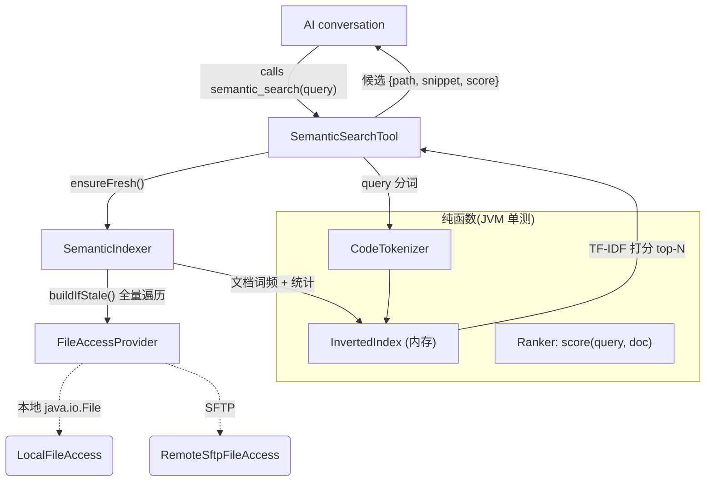

# Semantic Index (本地关键词召回语义索引)

Feature Name: semantic-index
Updated: 2026-09-18

## Description

为 AiCode 会话中的 AI 增加 `semantic_search` 工具：用自然语言（如“登录鉴权怎么实现”）在
当前工作区召回相关代码文件。实现为**本地 TF-IDF 关键词召回**：不调用远端 embedding、
不发任何网络请求，索引进程内存态、懒构建 + 失效重建。

区别于既有工具：

- `search`（rg）：精确正则/子串文本匹配，要求记住模式；
- `list`：目录枚举；
- `semantic_search`：对自然语言问句分词后按相关度打分召回文件列表，容忍词面差异。

## Architecture



## Components and Interfaces

### 1. `CodeTokenizer`（纯函数，JVM 可测）

对代码/自然语言文本产出可检索词元：

- 以非字母数字切分，忽略空白与符号；
- 下划线 / 中划线 / 点 / 驼峰边界分别拆词（`userLoginHandler` → `user`,`login`,`handler`；`auth_token` → `auth`,`token`）；
- 全小写归一；
- 长度 ≥ 1（把单字母如 `e`/`i` 保留，代码变量常见）；
- 对中文：按连续 CJK 段切为二元组（bigram）以支持中文注释/问句召回。

```kotlin
fun tokenize(text: String): List<String>
```

### 2. `InvertedIndex`（纯函数，JVM 可测）

内存倒排索引：

```kotlin
class InvertedIndex {
    // term -> docId -> 词频；内部统计 df、文档长度
    fun addDocument(docId: String, terms: List<String>)
    fun score(queryTerms: List<String>, k: Int): List<ScoredDoc>
}
data class ScoredDoc(val docId: String, val score: Double)
```

打分用 TF 归一（`1 + log(tf)`）× IDF（`log((N+1)/(df+1)) + 1`）累积，路径片段中的词元额外加权
（文件名命中权重高，便于“猜文件”）。不引入新依赖，自实现。

### 3. `SemanticIndexer`（Worker，串行执行）

- 状态：`地 — 工作区路径、索引快照（docId → mtime/size）、InvertedIndex`。
- `ensureFresh()`：每次查询前执行——
  1. 若索引未构建 → 全量构建；
  2. 若已构建 → 对比每个已索引文件与「新出现的 svg>文件」的快照（mtime/size）是否变化；
     有变化 → 全量重建。新文件出现（listFiles 遍历 diff）也触发。
- `build()` 全量遍历：从 `workspaceRepository.currentPath()` 递归 `listFiles`，
  跳过 `~/.git`、`build`、`.gradle`、`node_modules` 目录，跳过二进制（按扩展名黑名单 +
  大小上限，单个 > 1 MB 跳过）。每个文本文件 `readLines` 流式分词入索引。
  - 防护：索引文件数上限（MAX_FILES = 8000）与时间预算，超限即截断继续（只索引已扫部分），
    保证超大仓库不卡死工具。
- 运行在工具执行的调度上下文（挂起函数），用互斥锁保证「构建中再查询」排队等待而非并行构建。

### 4. `SemanticSearchTool`（Agent 工具）

- 注册名 `semantic_search`；`permissionPolicy = AUTO_APPROVE`；capability `READ_WORKSPACE`；
  与 `search` 一致，无需审批。
- 参数：`query`（字符串，必填）。
- 返回：Top-N（默认 8）候选，每项 `path` + `snippet`（命中词附近窗口，本地从文件读）+ `score`；
  同时返回 `indexed_files`、`elapsed_ms`、`backend = "local-tfidf"`。
- 错误码：空 query → `MISSING_QUERY`；远程构建失败 → `INDEX_UNAVAILABLE`。

### 5. 集成为点（DI / 注册）

- `AgentModule.kt` 工具注册处新增 `register("semantic_search", semanticSearchTool)`；
  新增 Hilt 绑定提供 `SemanticIndexer`（注入 `FileAccessProvider`、`WorkspaceRepository`）；
  组合对象方式与 `SearchCodeTool` 一致。
- `SemanticIndexer` 通过 `FileAccessProvider` 后端，本地/远程模式自动生效（远程走 SFTP 读取）。

## Data Models

无持久化、无 Room 迁移。全部内存态：

```kotlin
data class DocSnapshot(val mtime: Long, val size: Long)

class InvertedIndex {
    private val termDict = mutableMapOf<String, MutableMap<String, Int>>() // term -> docId -> tf
    private val docTerms = mutableMapOf<String, Int>()                       // docId -> total terms
    val docs = mutableSetOf<String>()
}
```

不落盘的原因：索引重建成本对单项目量级（几百~几千文件）在秒级，跨进程持久化引入增量一致性
复杂度与迁移风险，收益不匹配（见 Requirements 决策记录）。

## Correctness Properties

1. 同一工作区、同一文件内容下，相同 query 的召回结果稳定可复现（无随机）。
2. 索引快照与文件真实 `mtime/size` 一致时才返回缓存结果；任何被索引文件变化或新文件出现
   必然触发重建后再查询。
3. TF-IDF 打分单调：query 词全部命中的文档得分 ≥ query 词无命中的文档得分（无命中文档不返回）。
4. 并发安全：构建期间并发查询排队，不出现两个并行构建或读到半成品索引。
5. 隐私性与无外发：索引构建过程零网络调用，纯 CPU 与本地/SSH 文件读取。

## Error Handling

| 场景 | 行为 |
| -- | -- |
| query 为空 / 仅空白 | 工具返回 `MISSING_QUERY` 错误，不查索引 |
| 某个文件读取失败 | 跳过该文件记日志，继续构建其余文件，不中断整体 |
| 工作区不存在 / 为空 | 索引为空，返回「未索引任何文件」的提示性结果而非异常 |
| 远程 SSH 构建时连接中断 / 权限不足 | 工具返回 `INDEX_UNAVAILABLE` 错误 |
| 文件超过大小上限 / 二进制 | 跳过不索引 |
| 索引文件数超过 MAX_FILES | 截断，仅索引已扫描部分并注明 `truncated=true` |

## Test Strategy

纯 JVM 单元测试（沿用现有 `feature/agent` 测试目录风格，不依赖 Robolectric）：

1. **CodeTokenizerTest**：驼峰/下划线/点拆分、全小写、符号忽略、中文 bigram、边界（空串、全符号）。
2. **InvertedIndexTest**：单文档多 term 计数；跨文档 IDF 变化影响排序；词命中多于零次才返回；
   文件名列加权；同一 query 结果稳定。
3. **SemanticIndexerTest**：用临时目录 + `LocalFileAccess` 真实构建——
   - 首次调用触发构建并返回结果；
   - 修改既有文件 + 新增文件后再次查询返回新内容（失效重建）；
   - 二进制/超大/`.git`/`build` 目录被跳过；
   - 文件读取失败不中断。
4. **工具的注册与参数校验**：空 query 返回 `MISSING_QUERY`（沿用现有工具测试模式，
   如 `SearchCodeTool` 的解析逻辑若要测需容器，索引相关纯逻辑抽离即可测）。

## References

[^1]: (app/src/main/java/com/aicode/feature/workspace/domain/FileAccessProvider.kt#L34) - `FileAccessProvider` 统一本地/SFTP 后端接口
[^2]: (app/src/main/java/com/aicode/feature/workspace/domain/LocalFileAccess.kt#L26) - `readFile` / `readLines` 实现
[^3]: (app/src/main/java/com/aicode/feature/agent/domain/tool/explorer/SearchCodeTool.kt#L36) - `search` 工具（rg），`semantic_search` 参照其注册与权限模型
[^4]: (app/src/main/java/com/aicode/di/AgentModule.kt#L297) - 工具注册点 `register("search", searchCodeTool)`
[^5]: (app/src/main/java/com/aicode/feature/agent/domain/tool/explorer/ListFilesTool.kt) - 目录枚举工具，`semantic_search` 的兄弟工具