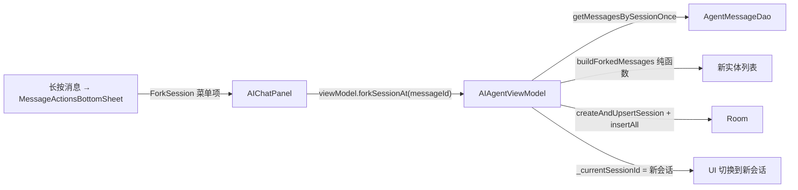

# 对话分叉（Session Fork）— 技术设计

Feature Name: session-fork
Updated: 2026-09-17

## Description

消息操作菜单新增「在此分叉新会话」：ViewModel `forkSessionAt(messageId)` 读取原会话全量消息，锚点及之前的消息复制进新会话（重生成 id + 替换 sessionId），切换当前会话。纯逻辑功能，无数据库迁移。

## Architecture



## Components and Interfaces

### 1. buildForkedMessages 纯函数（顶层，AIAgentViewModel.kt 内）

```kotlin
internal fun buildForkedMessages(
    source: List<AgentMessageEntity>,
    anchorId: String,
    newSessionId: String,
): List<AgentMessageEntity>
```

- 定位锚点 `indexOfFirst { it.id == anchorId }`，找不到返回空列表。
- 截取 `[0, anchorIndex]` 闭区间。
- 复制 = 原实体 `copy(id = 新UUID, sessionId = newSessionId)`，其余字段原样保留（content/role/timestamp/toolName/toolArgs/isError/attachmentsJson/reasoning/token 等）。
- 时间戳保持原值 → 新会话内顺序与原会话一致。
- id 用 `java.util.UUID.randomUUID().toString()`。

### 2. AIAgentViewModel.forkSessionAt

```kotlin
fun forkSessionAt(messageId: String) = viewModelScope.launch {
    val curId = _currentSessionId.value ?: return@launch
    val ws = _currentWorkspace.value
    if (ws.isBlank()) return@launch
    val source = agentMessageDao.getMessagesBySessionOnce(curId)
    val newSessionId = createAndUpsertSession(ws)   // 复用既有创建逻辑（绑定默认模型）
    val forked = buildForkedMessages(source, messageId, newSessionId)
    if (forked.isEmpty()) {
        sessionUseCase.deleteSession(newSessionId)   // 锚点无效则回滚空会话
        return@launch
    }
    agentMessageDao.insertAll(forked)
    // 沿用原会话标题，便于识别分叉来源
    val origTitle = sessionUseCase.getSessionById(curId)?.title
    if (!origTitle.isNullOrBlank()) sessionUseCase.updateTitle(newSessionId, origTitle)
    _currentSessionId.value = newSessionId
}
```

### 3. MessageActionsBottomSheet 新菜单项

在编辑、复制之间插入 `MessageActionItem(icon = FeatherIcons.GitBranch, title = chat_action_fork)`，回调 `onForkClick()`。AIChatPanel 调用处（AIChatPanel.kt:1390）传 `onForkClick = { viewModel.forkSessionAt(message.id) }` + Toast 成功提示。

## Correctness Properties

- 只在新会话插入复制消息，原会话消息零改动（copy 新实体 + insertAll，无 UPDATE/DELETE）。
- 锚点无效（找不到）→ 不落任何数据，回滚新建的空会话。
- 空源会话（无消息）→ buildForkedMessages 空列表 → 同上回滚，不发生静默空会话。
- 复制消息时间戳原样 → 新会话渲染顺序与源一致。
- title 沿用仅在源有标题时执行。

## Error Handling

| 场景 | 处理 |
|------|------|
| 无当前会话 / 无工作区 | forkSessionAt 直接 return |
| 锚点消息不存在 | 空列表 → 删除新建会话，无副作用 |
| insertAll 失败 | 异常记 FileLogger 并 newSession 空会话留在列表（罕见），不崩溃 |

## Test Strategy

`SessionForkTest`（纯 JVM，AgentMessageEntity 纯数据类）：
- 复制到锚点闭区间，锚点之后排除
- id 全部重生成且唯一，sessionId 替换为新值
- content/role/timestamp/token/附件字段原样
- 锚点找不到返回空列表

## References

- `app/src/main/java/com/aicode/feature/agent/presentation/component/MessageActionsBottomSheet.kt:39` — 菜单组件
- `app/src/main/java/com/aicode/feature/agent/presentation/component/AIChatPanel.kt:1390` — 菜单触发接线
- `app/src/main/java/com/aicode/feature/agent/presentation/AIAgentViewModel.kt:1788` — newSession 模式
- `app/src/main/java/com/aicode/feature/agent/presentation/AIAgentViewModel.kt:2314` — createAndUpsertSession
- `app/src/main/java/com/aicode/feature/agent/data/local/dao/AgentMessageDao.kt:12` — insertAll