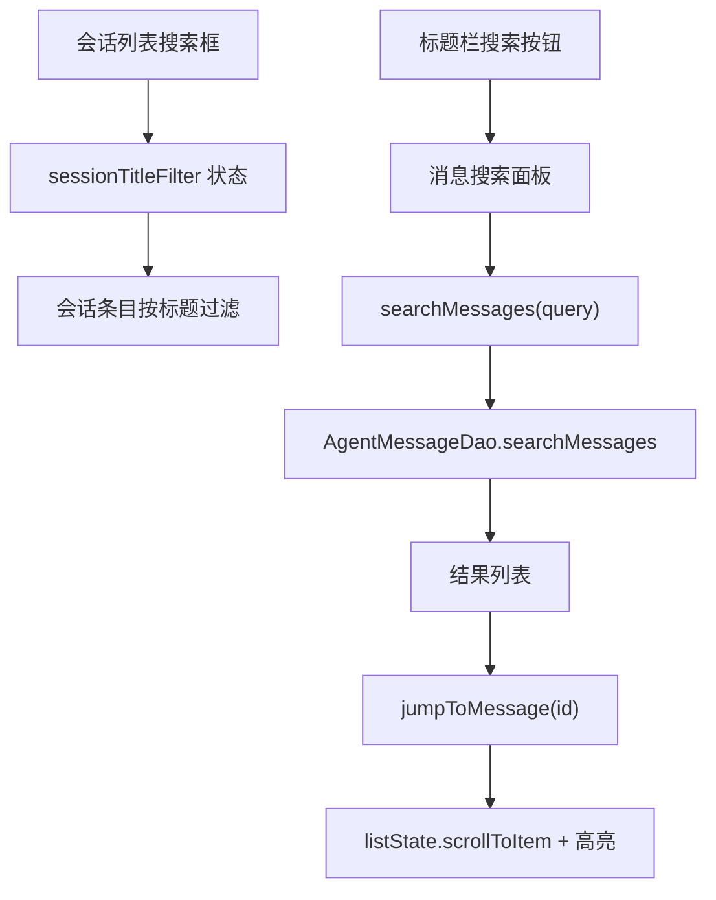

# 会话内搜索

Feature Name: session-search
Updated: 2026-09-13

## Description

两个搜索入口：会话列表顶部的标题过滤框，与聊天区顶部的消息全文搜索面板。消息搜索查全部已落库历史（Room LIKE 查询），点击结果跳转定位并高亮。

## Architecture



## Components and Interfaces

### 1. 会话列表标题过滤

- 位置：会话页（侧边栏）列表顶部，新增搜索框。
- `AIAgentViewModel` 新增 `sessionTitleFilter: MutableStateFlow<String>` 与 setter；会话列表渲染处按 `title.contains(filter, ignoreCase = true)` 过滤。
- 过滤仅作用于显示，搜索词按会话切换保留全局状态（清空即恢复）。

### 2. 消息搜索面板

- 位置：聊天顶部标题栏新增搜索图标，点击展开消息搜索面板（AnimatedVisibility，复用悬浮层面板样式）。
- 面板：搜索输入框 + 结果列表（LazyColumn，至多 50 条）。
- 结果条目：角色图标（用户/助手/工具）+ 匹配片段（命中词附近 ±40 字符，命中词高亮色）+ 相对时间。

### 3. 数据层

- `AgentMessageDao` 新增：
```kotlin
@Query("SELECT id, role, content, timestamp FROM agent_messages WHERE sessionId = :sessionId AND content LIKE '%' || :query || '%' ESCAPE '\\' ORDER BY timestamp DESC LIMIT :limit")
suspend fun searchMessages(sessionId: String, query: String, limit: Int): List<AgentMessageSearchRow>
```
- `AgentMessageSearchRow` 数据类（id/role/content/timestamp）；查询前由 ViewModel 对 `query` 做 LIKE 转义（`\%`、`\_`、`\\`）。
- 结果投影只取 4 列，避免整条消息（含 thinkingBlocksJson 大字段）进内存。

### 4. ViewModel

- `searchMessages(query: String)`：转义 → DAO 查询 → 映射为 UI 结果（含片段裁剪）。
- `jumpToMessage(id: String)`：在 `messages`（已加载分页）中找 index；未命中则按需扩大 `_messageLimit` 并等待流刷新后重试（至多 2 轮）；命中后 `listState.scrollToItem(index)` 并设置 `highlightMessageId`。
- `highlightMessageId` 状态：跳转时设置，5 秒后自动清除。

### 5. 高亮渲染

- `MessageBubbles` / 消息渲染处接收 `highlightMessageId: String?`，命中的气泡背景叠加高亮色（tertiaryContainer）。

## Data Models

- `AgentMessageSearchRow(id: String, role: String, content: String, timestamp: Long)`
- `MessageSearchResult(id, role, snippet: String, timestamp: Long)`

## Correctness Properties

- 搜索仅查已落库消息；正在流式输出的未落库文本不出现在结果中。
- LIKE 转义保证 `%`、`_`、`\` 按字面量匹配。
- 跳转的 index 与 LazyColumn item 顺序一致（chatItems 顺序）。

## Error Handling

- 查询为空 → 清空结果面板。
- DAO 查询失败 → FileLogger 记录，结果面板显示空态。
- 跳转目标经 2 轮扩页仍未命中 → 提示「消息可能已被清理」。

## Test Strategy

- DAO 查询：Room in-memory 测试覆盖 LIKE 命中、转义、limit、排序（如基建允许）。
- ViewModel：搜索转义函数纯单测；跳转扩页逻辑依赖 Compose 状态，冒烟编译 + 真机验证。

## References

[^1]: `app/src/main/java/com/aicode/feature/agent/data/local/dao/AgentMessageDao.kt` — 既有分页查询
[^2]: `app/src/main/java/com/aicode/feature/agent/presentation/component/AIChatPanel.kt` — 消息列表与 chatItems
