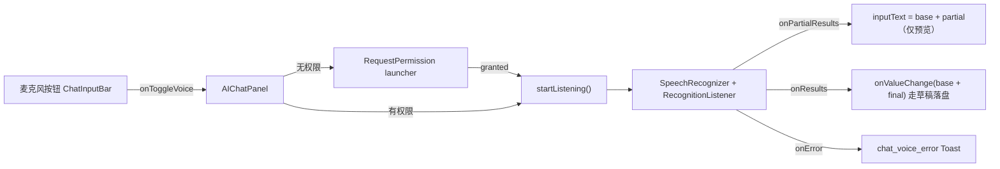

# 语音输入（Voice Input）

Feature Name: voice-input
Updated: 2026-09-17

## Description

聊天输入框工具栏新增麦克风按钮，内嵌系统 `SpeechRecognizer` 实现实时听写：点击开始、部分结果实时填入输入框、再点停止定稿并追加到基线文本之后。RECORD_AUDIO 运行时权限首用申请，拒绝或设备不支持时友好提示。

## Architecture

SpeechRecognizer 生命周期与状态全部内聚在 `AIChatPanel`（与附件、picker 管理同级），`ChatInputBar` 只增加受控入参（`isListening` / `onToggleVoice`），保持其纯受控组件定位。部分结果只更新 AIChatPanel 本地 `inputText` 做预览，定稿时经 `onValueChange` 走既有草稿落盘链路，避免高频 SharedPreferences 写入。



## Components and Interfaces

### 1. Manifest 权限

```xml
<uses-permission android:name="android.permission.RECORD_AUDIO" />
```

### 2. ChatInputBar 新增受控入参

```kotlin
isListening: Boolean = false,
onToggleVoice: () -> Unit = {},
```

按钮插在 UploadIconButton(+) 与优化按钮之间：听写中显示 Stop 图标（primary 色）+ `chat_voice_listening` contentDescription，空闲显示 Mic 图标。

### 3. AIChatPanel 语音控制器

`remember` 持有：

```kotlin
var isListening by remember { mutableStateOf(false) }
var voiceBaseText by remember { mutableStateOf("") }
val speechRecognizer = remember { 
    if (SpeechRecognizer.isRecognitionAvailable(context)) 
        SpeechRecognizer.createSpeechRecognizer(context) else null 
}
DisposableEffect(Unit) { onDispose { speechRecognizer?.destroy() } }
```

- `startListening()`：记 `voiceBaseText = inputText`，构造 `RecognizerIntent.ACTION_RECOGNIZE_SPEECH`（`EXTRA_LANGUAGE_MODEL_FREE_FORM`、`EXTRA_PARTIAL_RESULTS = true`、语言跟随系统默认），setRecognitionListener：
  - `onPartialResults`：`inputText = mergeDraft(voiceBaseText, partial)`
  - `onResults`：`isListening = false`；`onValueChange(mergeDraft(voiceBaseText, final))`（合并函数确保追加时以空白分隔、去重 trailing 空白）
  - `onError`：`isListening = false`；ERROR_NO_MATCH/ERROR_SPEECH_TIMEOUT 提示未听清，其余 `chat_voice_error`
  - `onEndOfSpeech`：保持 listening 状态等 results
- `toggleVoice()`：listening 中 → `stopListening()`；否则查权限 → 无则 launcher.launch(RECORD_AUDIO)，有则 `startListening()`。
- 权限 launcher：granted → `startListening()`；denied → Toast `chat_voice_permission_denied`。
- `speechRecognizer == null`（设备不支持）→ Toast `chat_voice_unavailable`。

### 4. mergeDraft 合并函数

```kotlin
private fun mergeDraft(base: String, recognized: String): String =
    buildString {
        append(base.trimEnd())
        if (isNotEmpty() && recognized.isNotBlank()) append(' ')
        append(recognized.trim())
    }
```

追加以空白分隔，保留基线内容（需求 3.1）。

## Data Models

| 名称 | 位置 | 说明 |
|------|------|------|
| `isListening` / `voiceBaseText` | AIChatPanel 本地 state | 听写状态与基线快照 |
| `SpeechRecognizer` | AIChatPanel remember + DisposableEffect | 系统识别器，随组合销毁 |

## Correctness Properties

- 部分结果仅改本地 `inputText`，`inputDraft` 在定稿前保持不变 → 无高频 SharedPreferences 写入。
- `LaunchedEffect(inputDraft)` 仅在 draft 变化时覆写 `inputText`；听写中 draft 未变，预览安全。
- recognizer 随组合销毁（DisposableEffect），语言切换 recreate 亦不泄漏。
- 停止后 `voiceBaseText` 重新快照，连续听写可叠加。

## Error Handling

| 场景 | 处理 |
|------|------|
| 权限拒绝 | Toast `chat_voice_permission_denied`，输入框不变 |
| 设备不支持 | Toast `chat_voice_unavailable`，按钮仍在（可重复尝试） |
| ERROR_NO_MATCH / SPEECH_TIMEOUT | Toast `chat_voice_no_match`（未听清），恢复空闲 |
| 其他 ERROR_* | Toast `chat_voice_error`，恢复空闲 |
| recognizer 已销毁后回调 | `isListening` 幂等置 false，UI 无副作用 |

## Test Strategy

- `mergeDraft` 纯函数单测（基线空/非空、识别空、首尾空白）。
- 真机验证：点击→说话→实时出字→停止定稿追加；拒绝权限→提示；听写中离开页面→无泄漏崩溃。

## References

- `app/src/main/java/com/aicode/feature/agent/presentation/component/ChatInputBar.kt:414` — 工具栏按钮区，麦克风插在 + 之后
- `app/src/main/java/com/aicode/feature/agent/presentation/component/AIChatPanel.kt:337` — inputText 本地 state
- `app/src/main/java/com/aicode/feature/settings/presentation/component/AppPermissionsSection.kt:96` — RequestPermission launcher 既有模式
